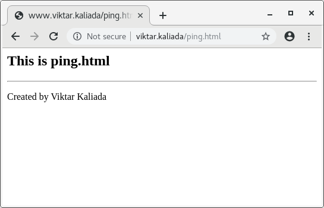
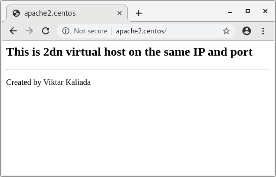
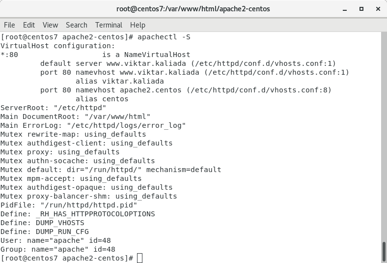
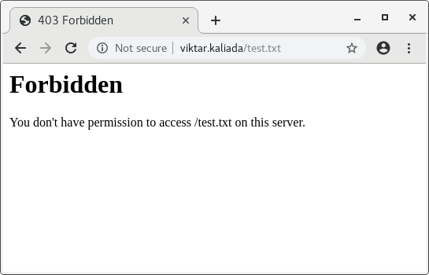

#### Task 2
[task2.sh](https://github.com/vickkoleda/apache_01/blob/master/task2.sh)
##### httpd ping page on first virtual host

##### httpd test page on second virtual host

##### Screenshots of output of httpd check after adding virtual host configuration file

##### httpd with error 403

