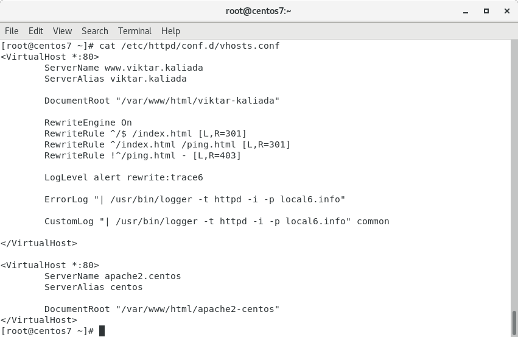
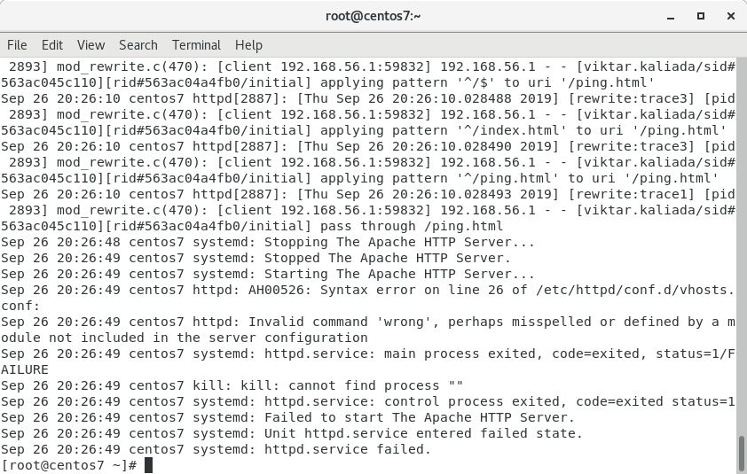
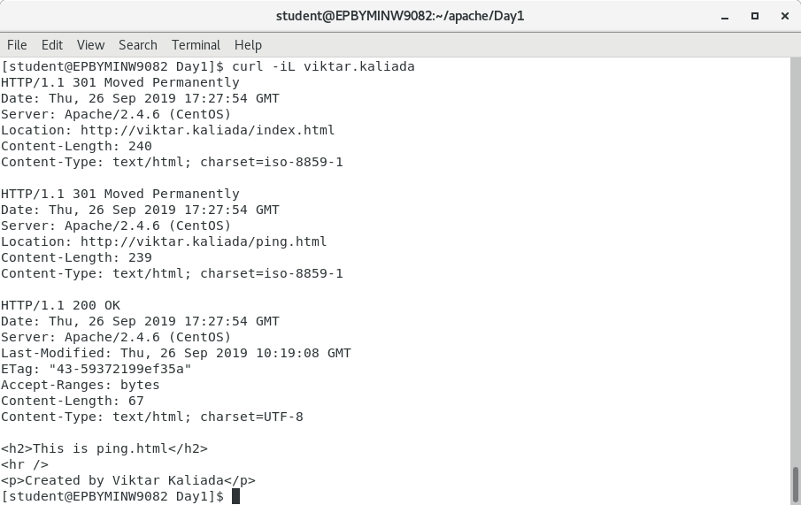
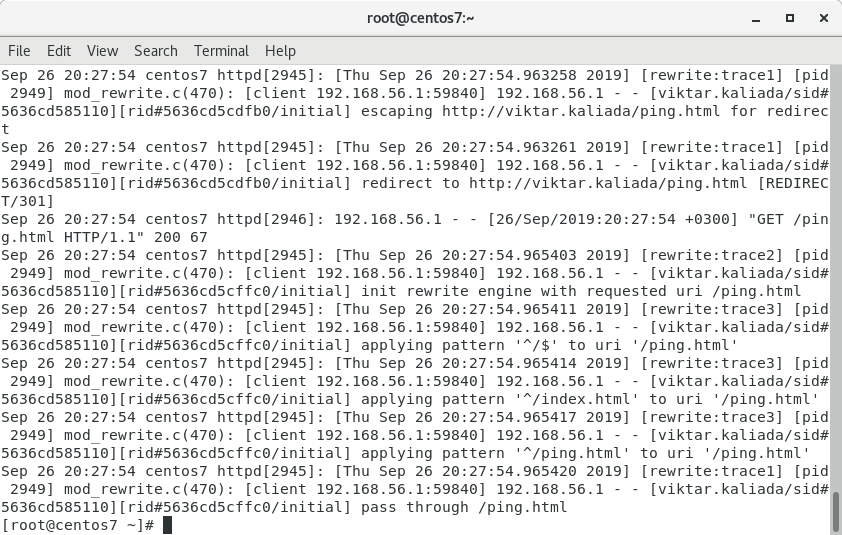

#### Task 2
[task4.sh](https://github.com/vickkoleda/apache_01/blob/master/task4.sh)
##### Screenshot of output of vritual hosts configuration file with modified logging section to work with syslog

##### Screenshot of output of /var/log/messages with mistake in virtual hosts configuration file

##### Screenshots of output of curl test request

##### creenshot of output of /var/log/messages with corresponding entry

